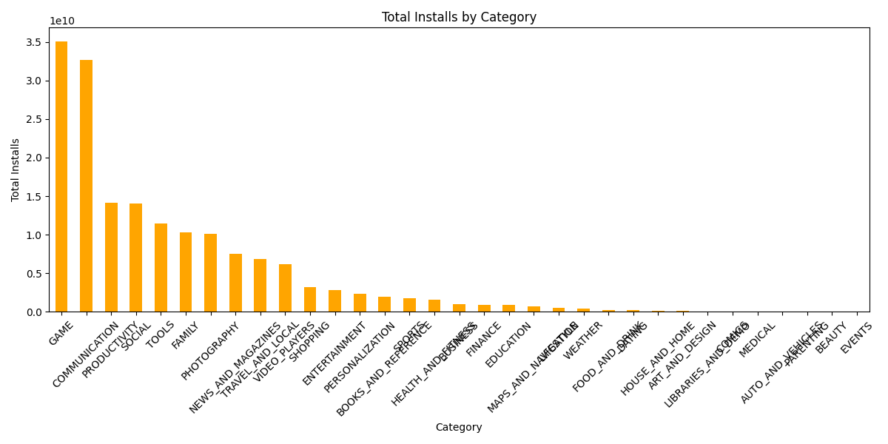
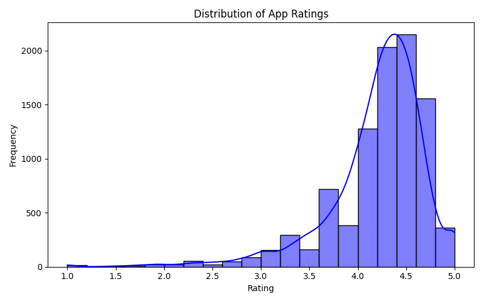
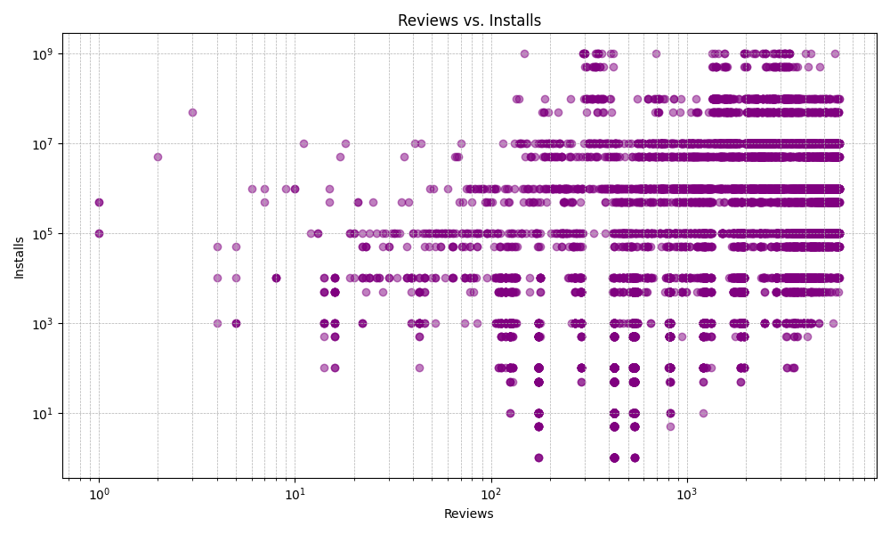

# Google Play Store Data Analysis

## Objective
The purpose of this project is to analyze the Google Play Store dataset to uncover key trends and insights about app popularity, user satisfaction, and engagement. This analysis explores app categories, user ratings, and review metrics.

---

## Dataset
- **Source**: The dataset contains information about Google Play apps, including their categories, installs, ratings, reviews, and pricing models.
- **Size**: Includes thousands of rows and columns such as `Category`, `Installs`, `Rating`, `Reviews`, and `Price`.

---

## Cleaning Steps
- Removed non-numeric characters (`','` and `'+'`) from the `Installs` column to allow numeric aggregation.
- Filtered rows with missing or invalid data in critical fields like `Installs`.

---

## Key Questions Explored
1. **Which app categories are the most popular based on installs?**
2. **How do app ratings and reviews correlate with popularity?**
3. **What insights can be gained about user satisfaction trends?**

---

## Key Findings
1. **App Popularity**:
   - Categories like **Games**, **Social**, and **Communication** dominate installs, highlighting high user engagement in entertainment and communication apps.
2. **Ratings Distribution**:
   - Ratings are predominantly clustered around 4.0–5.0, indicating strong user satisfaction.
3. **Reviews vs. Installs**:
   - A positive correlation exists between reviews and installs, with some apps having exceptional engagement.

---

## Visualizations
### 1. Total Installs by Category


### 2. Distribution of Ratings


### 3. Reviews vs. Installs


---

## How to Reproduce
1. Clone this repository:
   ```bash
   git clone https://github.com/your-username/google-play-analysis.git
